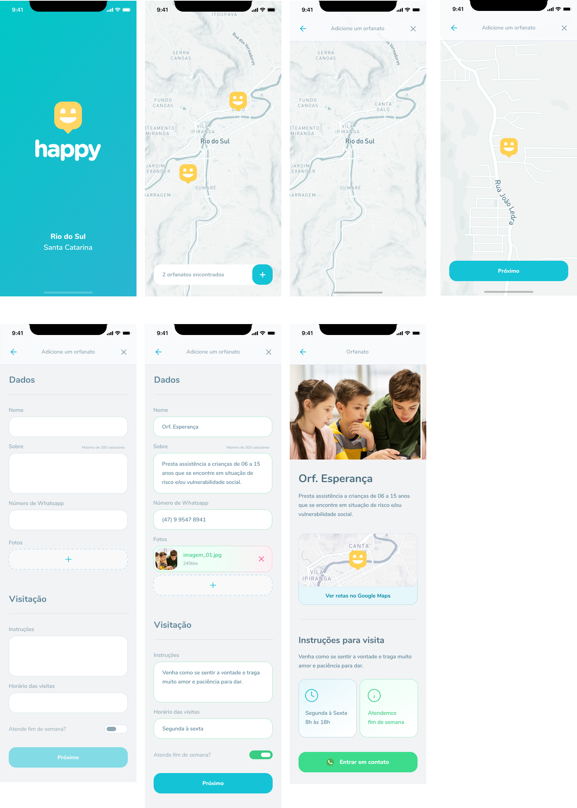
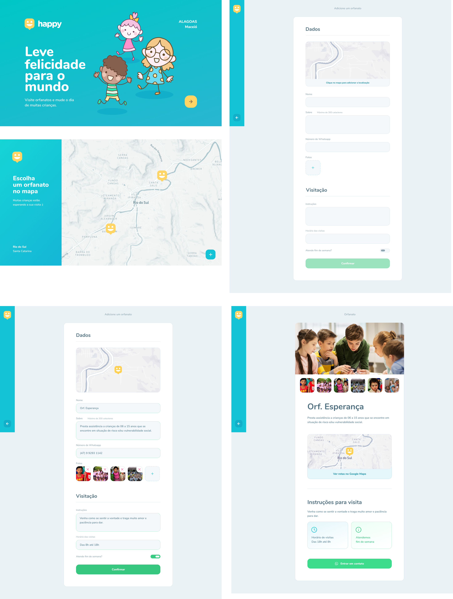

<h1 align="center">
    
</h1>

  <a href="#-tecnologias">Tecnologias</a>&nbsp;&nbsp;&nbsp;|&nbsp;&nbsp;&nbsp;
  <a href="#-projeto">Projeto</a>&nbsp;&nbsp;&nbsp;|&nbsp;&nbsp;&nbsp;
  <a href="#-layout">Layout</a>&nbsp;&nbsp;&nbsp;|&nbsp;&nbsp;&nbsp;
  <a href="#memo-licença">Licença</a>

 

  

 

  

## 🚀 Tecnologias

Esse projeto foi desenvolvido com as seguintes tecnologias:

- [Node.js](https://nodejs.org/en/)
- [React](https://reactjs.org)
- [React Native](https://facebook.github.io/react-native/)
- [Expo](https://expo.io/)
- [TypeScript](https://www.typescriptlang.org/)

## 💻 Projeto

O Happy é um projeto de desenvolvimento Web/Mobile, criado na terceira edição do workshop promovido pela Rocketseat, conhecida como Next Level Week - NLW que disponibiliza, aulas, materiais complementares e uma trilha para construção dessa aplicação. Este é o resultado, a minha versão do projeto, o que aprendi. Material muito completo, dinâmico e preciso, deixo aqui meu agradecimento a rocketseat.

O Projeto consiste numa aplicação que conecta pessoas à casas de acolhimento institucional para fazer o dia de muitas crianças mais feliz. 💜

### Recursos abordados
- [x] Conceitos de backend, frontend e API
- [x] React, TypeScript, ReactJS, 
- [x] Back-end com Node.js
- [x] Node.js com Typescript
- [x] Express - Microframework web para criação das APIs
- [x] Insomnia - Testes de rotas das APIs
- [x] Migration - Controle das estruturas do banco de dados
- [x] Beekeeper Studio - Cliente de banco de dados SQLite
- [x] Medels, rotas, validação de dados back-end
- [x] Decorators
- [x] rotas, parâmetros e métodos HTTP
- [x] Arquitetura do Banco de Dados
- [x] Persistência de Dados (Driver nativo - Query builder - ORM)
- [x] State dentro do React
- [x] Hooks (ganchos) - useEffect() useState()
- [x] Programação Declarativa
- [x] Abstraindo em controller
- [x] Upload de imagens
- [x] Desenvolvimento tradicional Nativo vs Multiplataforma (RN)
- [x] Trabalhando com Views
- [x] Lidando com exceções
- [x] Componentes (State, Funções/Comportamento, Visual (HTML+CSS))
- [x] Validação de dados
- [x] Estruturando APP mobile
- [x] Single-page Application (SPA)
- [x] React Native e as diferenças para ReactJS
- [x] Utilizando Expo
- [x] Loading Page
- [x] Trabalhando com rotas
- [x] Utilização de mapas

## 🔖 Layout

Abaixo você encontra o layout do projeto web e também mobile. 

### Layout Mobile

  

### Layout Web

  

## :memo: Licença

Esse projeto está sob a licença MIT.
