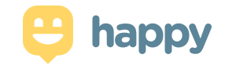

<h1 align="center">
    
</h1>

  <a href="#-tecnologias">Tecnologias</a>&nbsp;&nbsp;&nbsp;|&nbsp;&nbsp;&nbsp;
  <a href="#-projeto">Projeto</a>&nbsp;&nbsp;&nbsp;|&nbsp;&nbsp;&nbsp;
  <a href="#-layout">Layout</a>&nbsp;&nbsp;&nbsp;|&nbsp;&nbsp;&nbsp;
  <a href="#memo-licença">Licença</a>

 

  

 

  

## 🚀 Tecnologias

Esse projeto foi desenvolvido com as seguintes tecnologias:

- [Node.js](https://nodejs.org/en/)
- [React](https://reactjs.org)
- [React Native](https://facebook.github.io/react-native/)
- [Expo](https://expo.io/)
- [TypeScript](https://www.typescriptlang.org/)

## 💻 Projeto

O Happy é um projeto de desenvolvimento Web/Mobile, criado na terceira edição do workshop promovido pela Rocketseat, conhecida como Next Level Week - NLW. Esta é a minha versão do projeto, o que aprendi. 

O Projeto consiste numa aplicação que conecta pessoas à casas de acolhimento institucional para fazer o dia de muitas crianças mais feliz. 💜

## 🔖 Layout

Abaixo você encontra o layout do projeto web e também mobile. 

### Layout Mobile

  

### Layout Web

  

## :memo: Licença

Esse projeto está sob a licença MIT.
